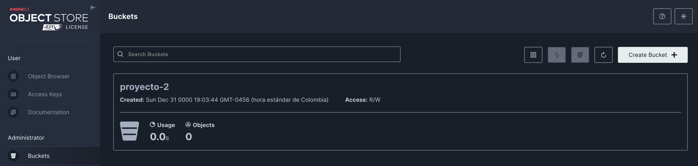
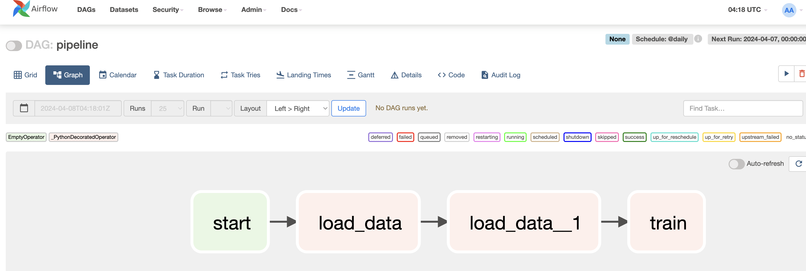
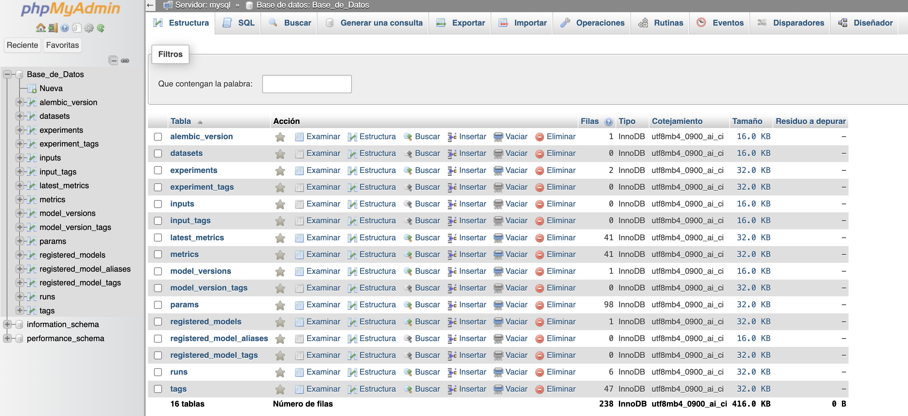
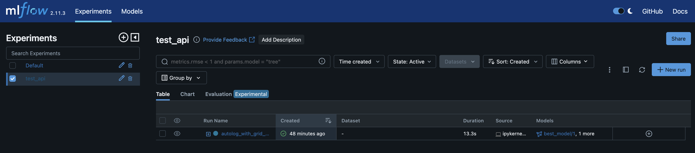
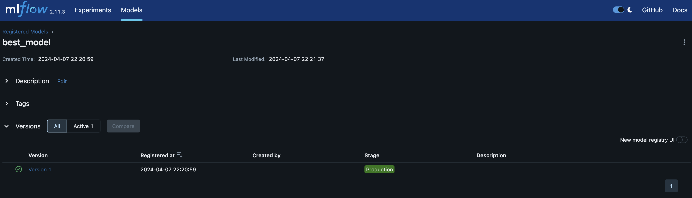
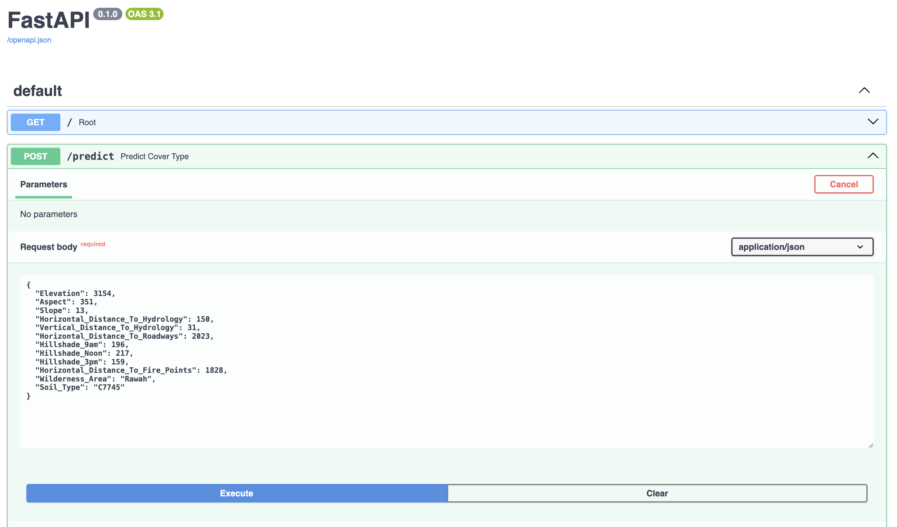

# Proyecto 2 MLOPS

Desarrollado por **Grupo 3**.

Integrantes:
* Anthony Amaury Bossa
* José Luis Vega
* Víctor Andrés De La Hoz

## Puertos para acceder a los servicios:
Este proyecto se encuentra desplegado en las siguientes direcciones:
* Streamlit: `http://10.43.101.152:8087`
* airflow: `http://10.43.101.152:8080`
    * Usuario: airflow
    * Contraseña: airflow
* mlflow: `http://10.43.101.152:8083`
* MinIO: `http://10.43.101.152:8089`
    * Usuario: minioadmin
    * Contraseña: minioadmin
* Admin (acceder a la base de datos MySQL): `http://10.43.101.152:8081`
    * Usuario: ab
    * Contraseña: ab
* MySQL: `http://10.43.101.152:8082` (se puede visualizar desde Admin)
* 


## Instrucciones Construcción de la solución:
A continuación encontrará las instrucciones para replicar este desarrollo.

1. Clone el repositorio usando el comando:

    `git clone https://github.com/thonybossa/MLOPS.git`

2. Ubiquese en el directorio correspondiente al proyecto 2:

    `cd MLOPS/Proyecto_2`

3. Ejecute desde la terminal el comando
    ```bash
    docker-compose up
    ```
4. Dirijase a un buscador y escriba la dirección `localhost:8089` en la que se desplegará una web de MinIO en donde deberá colocar las credenciales:
    * Usuario: minioadmin
    * Contraseña: minioadmin

    - Cree un bucket llamado `proyecto-2`.

    

6. Ahora, dirijase a un buscador y escriba la dirección `localhost:8080` en la que se desplegará una web de airflow en donde deberá colocar las credenciales:
    * Usuario: airflow
    * Contraseña: airflow

    

5. Active y ejecute el Dag para verificar su ejecución. Este Dag, consiste en la extracción de datos de una API, construcción de una tabla en una base de datos y la generación de un modelo de clasificación al que le podrá realizar seguimiento desde mlflow. En caso de querer revisar cómo están almacenandose los datos, podrá dirigirse a la dirección `localhost:8081` en donde encontrará una interfaz de pgAdmin en la que podrá colocar las credenciales:
    * Usuario: ab
    * Contraseña: ab
Este mismo servicio de mysql fue usado como almacenamiento de los metadatos de mlflow, allí podrá verificarlo.

    

6. La dirección donde se encuentra MlFlow es `localhost:8083`. Allí podrá observar las ejecuciones de los experimentos, sus parámetros y métricas.

    

7. Para garantizar la ejecución de la API, es necesario que previamente, tenga ejecutado y guardado un modelo como "best_model" con el tag de producción. Para esto, en la interfaz de mlflow seleccione un modelo, parese en alguna version y en tag escoja "Producción".

    

8. Dirijase a la dirección `localhost:8085/docs` en la que se desplegará una web de FastAPI en donde podrá realizar peticiones POST a la dirección `localhost:8085/predict` con el siguiente formato:
    ```json
    {
        "data": {
            "Elevation": 3154,
            "Aspect": 351,
            "Slope": 13,
            "Horizontal_Distance_To_Hydrology": 150,
            "Vertical_Distance_To_Hydrology": 31,
            "Horizontal_Distance_To_Roadways": 2023,
            "Hillshade_9am": 196,
            "Hillshade_Noon": 217,
            "Hillshade_3pm": 159,
            "Horizontal_Distance_To_Fire_Points": 1828,
            "Wilderness_Area": "Rawah",
            "Soil_Type": "C7745"
        }
    }
    ```
    

Como se mencionó en la introducción, lo ideal es que simplemente se dispongan los puertos en los que se pueden observar los servicios, pero en caso de que se desee realizar pruebas, se puede hacer uso de los servicios de MinIO, Airflow, PgAdmin y MlFlow, anteriormente mencionados.