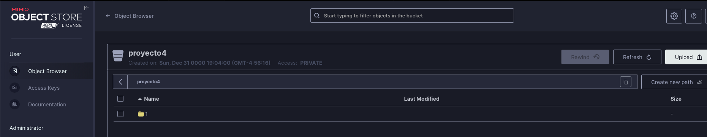
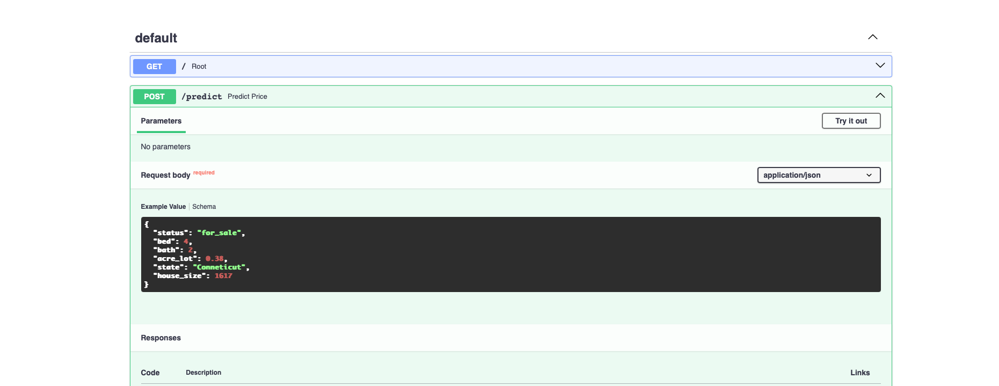
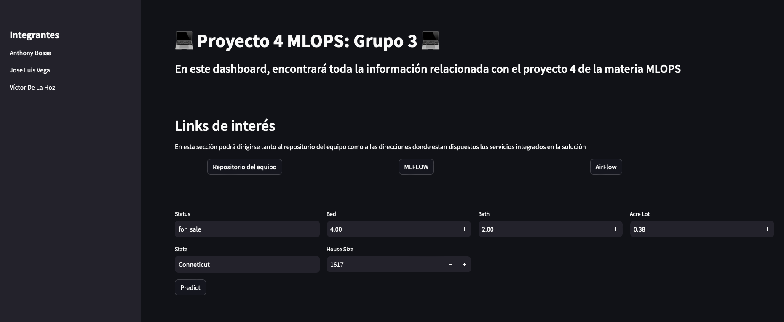

# Proyecto 3 MLOPS

Desarrollado por **Grupo 3**.

Integrantes:
* Anthony Amaury Bossa
* José Luis Vega
* Víctor Andrés De La Hoz

## Puertos para acceder a los servicios en máquina virtual:
Este proyecto se encuentra desplegado en las siguientes direcciones:
* Streamlit: `http://10.43.101.152:8087`
* FastAPI(Data train) `http://10.43.101.152:8084`
* FastAPI(model prediction) `http://10.43.101.152:8085/docs`
* airflow: `http://10.43.101.152:8080`
    * Usuario: airflow
    * Contraseña: airflow
*Jupyter: `http://10.43.101.152:8086`
    * Contraseña: token
* mlflow: `http://10.43.101.152:8083`
* MinIO: `http://10.43.101.152:8089`
    * Usuario: minioadmin
    * Contraseña: minioadmin
* Admin (acceder a la base de datos MySQL): `http://10.43.101.152:8081`
    * Usuario: ab
    * Contraseña: ab
* MySQL: `http://10.43.101.152:8082` (se puede visualizar desde Admin)
## Instrucciones para construcción local de la solución:
A continuación encontrará las instrucciones para replicar este desarrollo.

1. Clone el repositorio usando el comando:

    `git clone https://github.com/thonybossa/MLOPS.git`

2. Ubiquese en el directorio correspondiente al proyecto 3:

    `cd MLOPS/Proyecto_3/data`
3. Ejecute desde la terminal el siguiente comando el cual levantara la API con el endpoint para tomar tomar los datos
    ```bash
    docker-compose up
    ```
4. Despues ubiquese en el siguiente directorio
    `cd MLOPS/Proyecto_3` <br>
   y ejecute el siguiente comando para levantar los servicios disponibles en el docker-compose
   ```bash
    docker-compose up
    ```
Ahora siga los siguientes pasos Para levantar los servicios en Kubernetes


5. Ubiquese en la carpeta  `cd MLOPS/Proyecto_3/Kubernetes` y ejecute el siguiente comando 
     ```bash
    sudo microk8s kubectl delete --all daemonsets,replicasets,services,deployments,pods,rc,ingress --namespace=default
    ```
6. Ejecute los siguientes comandos en la terminal
    ```bash
    curl -L https://github.com/kubernetes/kompose/releases/download/v1.26.0/kompose-linux-amd64 -o kompose
    chmod +x kompose
    sudo mv ./kompose /usr/local/bin/kompose
    ```
7. luego convierta el docker compose a archivos de configuracion yaml
     ```bash
    kompose convert -f docker-compose.yml -o komposefiles/ --volumes hostPath
    ```
8. Ejecutar el siguiente comando 
     ```bash
    microk8s kubectl apply -f komposefiles/
    ```
9. Para ver especificamente los servicios
    ```bash
    microk8s kubectl get service
    ```
10. Para exponer de manera los servicios ejecutamos los siguiente comandos en la terminal 
    ```bash
    mmicrok8s kubectl port-forward --address 0.0.0.0 service/adminer 8088:8088
    ```
    ```bash
    mmicrok8s kubectl port-forward --address 0.0.0.0 service/adminer 8089:8089
    ```

11. Dirijase a un buscador y escriba la dirección `localhost:8089` en la que se desplegará una web de MinIO en donde deberá colocar las credenciales:
    * Usuario: minioadmin
    * Contraseña: minioadmin

    - Cree un bucket llamado `proyecto-3`.

     
12. Ahora, dirijase a un buscador y escriba la dirección `localhost:8080` en la que se desplegará una web de airflow en donde deberá colocar las credenciales:
    * Usuario: airflow
    * Contraseña: airflow

    
    
13.Active y ejecute el Dag para verificar su ejecución. Este Dag, consiste en la extracción de datos de una API, construcción de una tabla en una base de datos y la generación de un modelo de clasificación al que le podrá realizar seguimiento desde mlflow. En caso de querer revisar cómo están almacenandose los datos, podrá dirigirse a la dirección `localhost:8081` en donde encontrará una interfaz de pgAdmin en la que podrá colocar las credenciales:
    * Usuario: ab
    * Contraseña: ab
Este mismo servicio de mysql fue usado como almacenamiento de los metadatos de mlflow, allí podrá verificarlo.

    

8.Una vez se ejecute el DAG en Airflow podra dirigirse a MlFlow donde podra verificar la creacion  del experimento y el modelo con el nombre "best_model" 
    
    

14.  Dirijase a la dirección `localhost:8085/docs` en la que se desplegará una web de FastAPI en donde podrá realizar peticiones POST a la dirección `localhost:8085/predict` con el siguiente formato:
```json
{
  "race": "AfricanAmerican",
  "gender": "Female",
  "age": "[60-70)",
  "admission_type_id": "1",
  "discharge_disposition_id": "3",
  "admission_source_id": "5",
  "time_in_hospital": "7",
  "medical_specialty": "Nephrology",
  "num_lab_procedures": "47",
  "num_procedures": "2",
  "num_medications": "29",
  "number_emergency": "0",
  "number_inpatient": "1",
  "diag_1": "38",
  "diag_2": "263",
  "diag_3": "403",
  "number_diagnoses": "9",
  "insulin": "Steady",
  "change": "Ch",
  "diabetesMed": "Yes"
}
```

 
 
 15. Y ya por ultimo dirijase a la dirección `localhost:8087` en la que se desplegará una web de Streamlit:

  