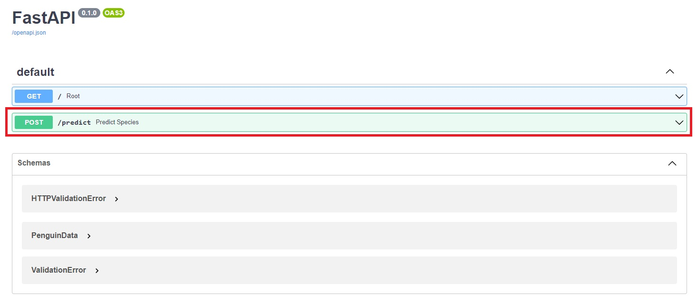
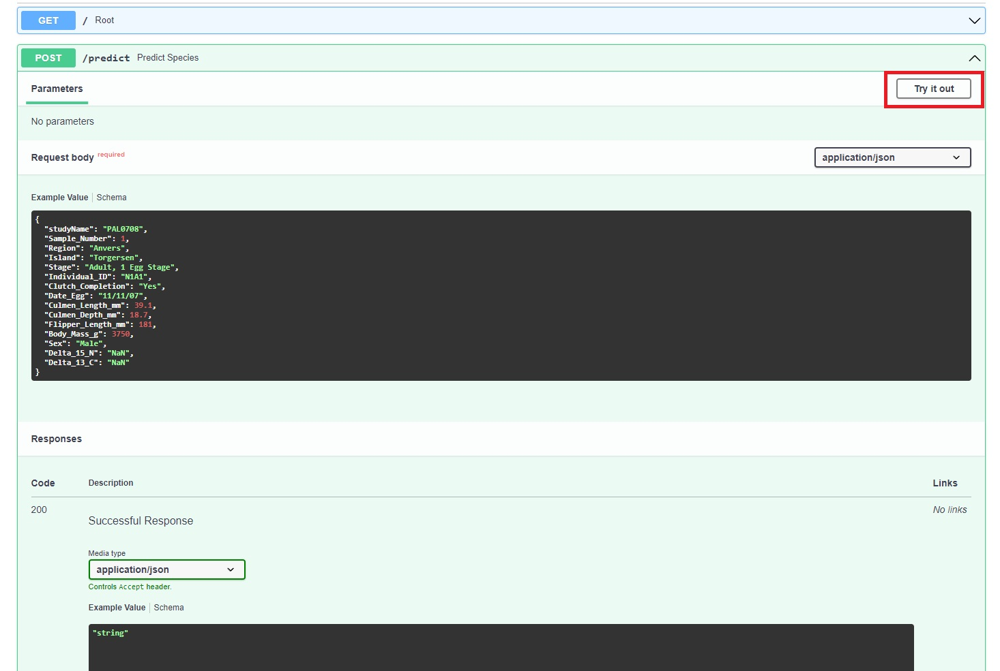

# Taller 1 MLOPS

Desarrollado por **Grupo 3**.

Integrantes:
* Anthony Amaury Bossa
* José Luis Vega
* Víctor Andrés De La Hoz

## Construyendo la imagen y el contenedor:
A continuación encontrará las instrucciones para construir la imagen y el contenedor en los que se encuentra la solución del taller.

1. Clone el repositorio usando el comando:

    `git clone https://github.com/thonybossa/MLOPS.git <directorio destino>`

    Por defecto, `<directorio destino>` será `MLOPS` pero usted podrá modificarlo como prefiera.

2. Ubiquese en la dirección creada automáticamente mediante:

    `cd <directorio creado>`

3. Construya la imagen usando el comando

    `docker build -t <nombre imagen> .`
    
    En este caso `<nombre imagen>` corresponde al nombre de la imagen que usted quiera definir.

4. Construya el contenedor usando el comando
    `docker run --name <nombre contenedor> -p 8989:8989 <nombre imagen>`
    
    En este caso `<nombre contenedor>` corresponde al nombre del contenedor que usted quiera definir.

5. Dirígase a su explorador y en la barra de búsqueda, pegue la siguente dirección 

    `localhost:8989/docs`

6. Se abrirá la documentación de la API desde la cual usted podrá realizar pruebas de petición para verificar que el modelo predice correctamente.


## Documentación de la API
Después de realizar los anteriores pasos se desplegará una ventana como esta:



Al hacer click en POST, verá lo siguiente:



Al presionar en `Try Out`, podrá cambiar los valores y presionando `execute` obtendrá la predicción que se genera para los datos indicados:


## Detalle Predicciones:

Las predicciones que se obtienen de la petición son los valores 0, 1 o 2, cuya especie respectiva es:

* **Clase 0:** *Adelie Penguin (Pygoscelis adeliae)*
* **Clase 1:** *Chinstrap penguin (Pygoscelis ant*arctica)*
* **Clase 2:** *Gentoo penguin (Pygoscelis papua)*

## Configuraciones para analizar predicciones

A continuación, se dejan 3 configuraciones diferentes con datos reales que podrá usar para obtener la predicción respectiva en cada caso:

**Clase 0:**
```json
{
  "studyName": "PAL0708",
  "Sample_Number": 1,
  "Region": "Anvers",
  "Island": "Torgersen",
  "Stage": "Adult, 1 Egg Stage",
  "Individual_ID": "N1A1",
  "Clutch_Completion": "Yes",
  "Date_Egg": "11/11/07",
  "Culmen_Length_mm": 39.1,
  "Culmen_Depth_mm": 18.7,
  "Flipper_Length_mm": 181,
  "Body_Mass_g": 3750,
  "Sex": "Male",
  "Delta_15_N": "NaN",
  "Delta_13_C": "NaN"
}
```
**Clase 1:**
```json
{
  "studyName": "PAL0708",
  "Sample_Number": 50,
  "Region": "Anvers",
  "Island": "Dream",
  "Stage": "Adult, 1 Egg Stage",
  "Individual_ID": "N88A2",
  "Clutch_Completion": "Yes",
  "Date_Egg": "11/21/09",
  "Culmen_Length_mm": 48.1,
  "Culmen_Depth_mm": 16.4,
  "Flipper_Length_mm": 199,
  "Body_Mass_g": 3325,
  "Sex": "Female",
  "Delta_15_N": "NaN",
  "Delta_13_C": "NaN"
}
```

**Clase 2:**
```json
{
  "studyName": "PAL0708",
  "Sample_Number": 18,
  "Region": "Anvers",
  "Island": "Biscoe",
  "Stage": "Adult, 1 Egg Stage",
  "Individual_ID": "N39A2",
  "Clutch_Completion": "Yes",
  "Date_Egg": "11/27/07",
  "Culmen_Length_mm": 49.2,
  "Culmen_Depth_mm": 15.2,
  "Flipper_Length_mm": 221,
  "Body_Mass_g": 6300,
  "Sex": "Male",
  "Delta_15_N": "NaN",
  "Delta_13_C": "NaN"
}
```

Para mayor información sobre la construcción del modelo, consulte Model/train_model.ipynb


