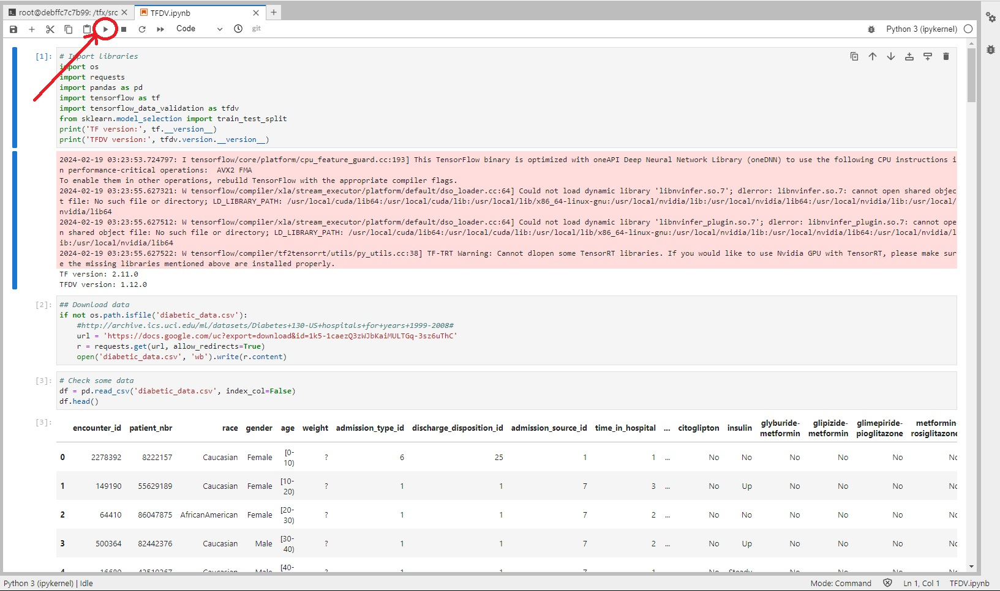

# Taller 2 MLOPS

Desarrollado por **Grupo 3**.

Integrantes:
* Anthony Amaury Bossa
* José Luis Vega
* Víctor Andrés De La Hoz

## Desarrollo:
A continuación encontrará las instrucciones relacionadas con la solución del taller 2 en el que usando un archivo `docker-compose.yaml` podrá imitar la ejecución del comando `sudo docker run -it --name tfx --rm -p 8888:8888 -p 6006:6006 -v $PWD:/tfx/src --entrypoint /run_jupyter.sh  tensorflow/tfx:1.12.`

1. Clone el repositorio usando el comando:

    `git clone https://github.com/thonybossa/MLOPS.git`

2. Ubiquese en el directorio correspondiente al taller 2:

    `cd MLOPS/Taller_2`

3. Ejecute desde la terminal el comando
    ```bash
    docker-compose up
    ```
    Automáticamente docker:
    * Revisará si la imagen tensorflow/tfx:1.12 existe en local, de lo contrario la traerá y la construirá.
    * Una vez construida la imagen, procederá con el levantado del contenedor en el puerto indicado. En este punto existen dos opciones:
        * Seguir el link que aparece al final en la terminal cuyo formato es:
        ```zsh
        http://127.0.0.1:8888/lab?token=<TOKEN>
        ```
        * Dirigirse a un buscador y seguir la dirección `localhost:8888` en la que se desplegará una web de jupyter en donde deberá colocar el token que aprece en el link mencionado anteriormente.

4. Una vez ubicado en la interfaz de jupyter lab, deberá descargar los archivos correspondientes a los notebooks del taller. Para esto, ejecute los siguientes comandos en la terminal de jupyter:
    * *Notebook de TensorFlow:*
    ```bash
    wget https://raw.githubusercontent.com/CristianDiazAlvarez/MLOPS_PUJ/main/Niveles/1/Validacion_de_datos/TF/TFDV.ipynb
    ```
    * *Notebook de ML_Metadata:*
    ```bash
    wget https://raw.githubusercontent.com/CristianDiazAlvarez/MLOPS_PUJ/main/Niveles/1/Transformacion_de_datos/ML_Metadata.ipynb
    ```
5. Ejecute los notebooks:
    

___
### Docker-Compose
El archivo que permite que todo esto sea posible es `docker-compose`, cuyo contenido se muestra a continuación

```bash
version: '3.8'

services:
  tfx:
    image: tensorflow/tfx:1.12.0
    ports:
      - "8888:8888"
      - "6006:6006"
    volumes:
      - ${PWD}:/tfx/src
    entrypoint: /run_jupyter.sh
    stdin_open: true
    tty: true
    restart: "no"
```