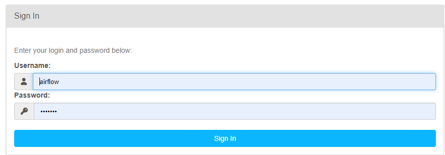
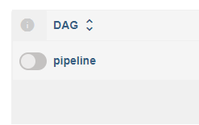
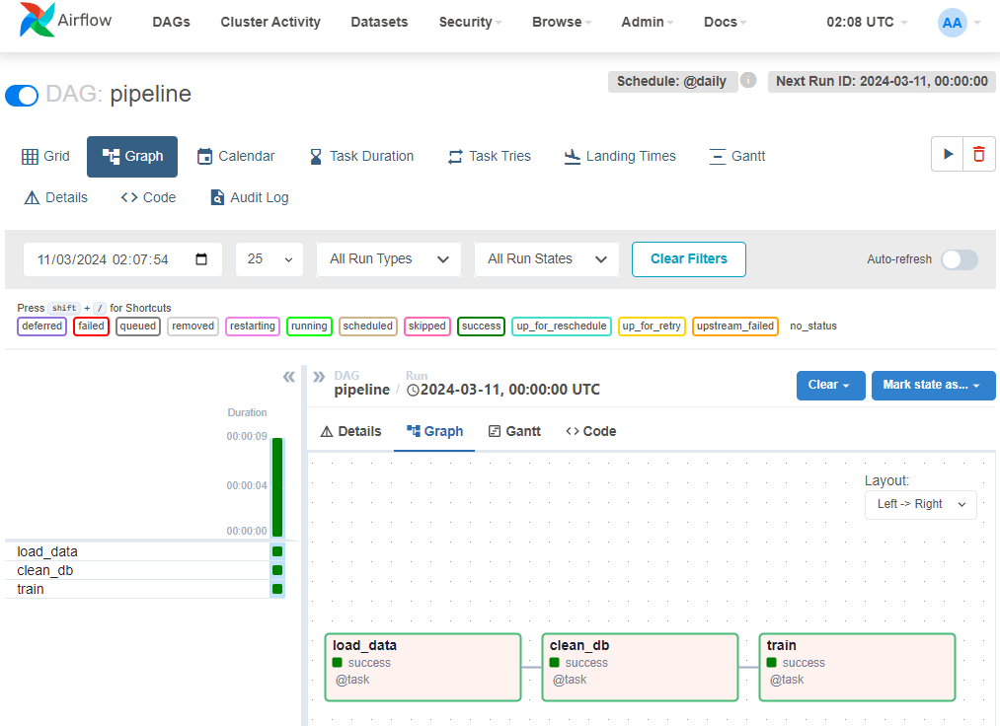

# Taller 3 MLOPS

Desarrollado por **Grupo 3**.

Integrantes:
* Anthony Amaury Bossa
* José Luis Vega
* Víctor Andrés De La Hoz

## Desarrollo:
A continuación encontrará las instrucciones relacionadas con la solución del proyecto 1.

1. Clone el repositorio usando el comando:

    `git clone https://github.com/thonybossa/MLOPS.git`

    En caso de ya tener el repositorio, actualice su contenido: `git pull`

2. Ubiquese en el directorio correspondiente al taller 3:

    `cd MLOPS/Taller_3`

3. Ejecute desde la terminal el comando
    ```bash
    docker-compose up
    ```
     Automáticamente docker:
    * Revisará si las imagenes necesarias para la ejecución de Airflow existen en local, de lo contrario las traerá y las construirá.
    * Instalará las dependencias que se deben usar.
    * Una vez construidas las imagenes e instaladas las dependencias, procederá con el levantado del contenedor en el puerto indicado. En este caso es el puerto 8080.
    * Dirigirse a un buscador y escriba la dirección `localhost:8080` en la que se desplegará una web de Airflow en donde deberá colocar el usuario y contraseña: `airflow` y `airflow` respectivamente.

    


4. En la interfaz de Airflow, busque el dag llamado `pipeline` y haga click sobre él:



5. Se desplegará una ventana en la que al hacer click sobre Graph, podrá ver todos las tareas que se ejecutan en el dag:

