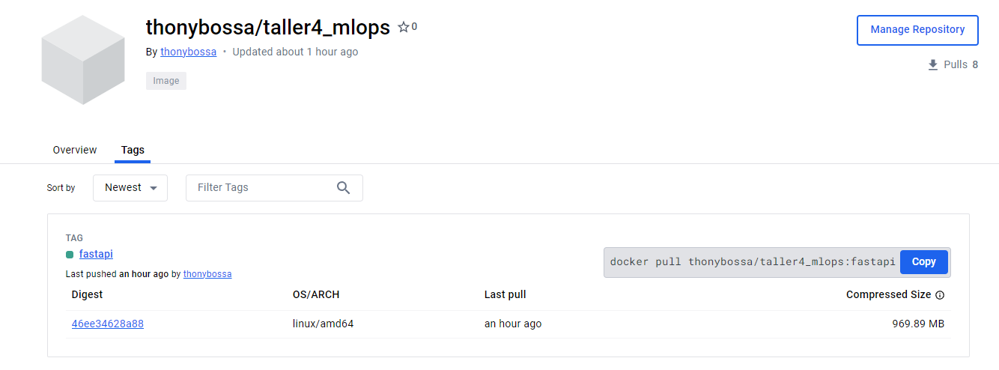
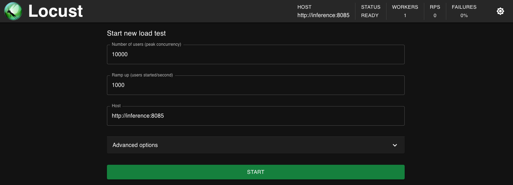
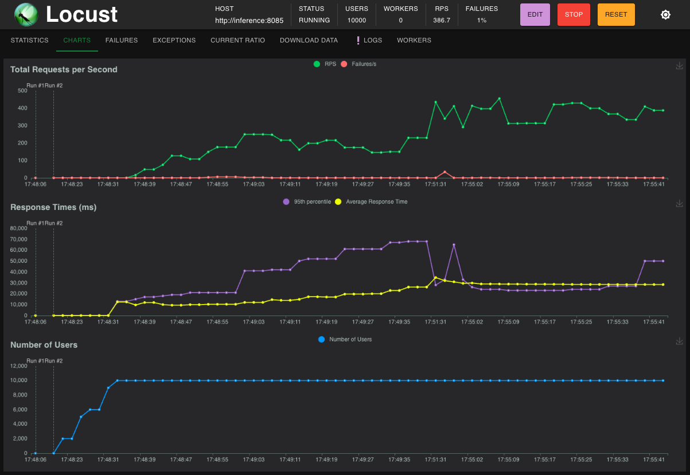

# Taller 4 MLOPS

Desarrollado por **Grupo 3**.

Integrantes:
* Anthony Amaury Bossa
* José Luis Vega
* Víctor Andrés De La Hoz

## Desarrollo:
A continuación encontrará el paso a paso para realizar push de una imagen de FastAPI a Dockerhub y realizar pruebas de carga con Locust.

> [!WARNING] 
>
> Este taller depende del [proyecto 2](https://github.com/thonybossa/MLOPS/tree/main/Proyecto_2), por lo que se asume que ya se tiene una imagen de FastAPI creada y funcional.

### 1. Carga de imagen en Dockerhub
Usando la imagen de FastAPI creada en el [proyecto 2](https://github.com/thonybossa/MLOPS/tree/main/Proyecto_2) procedemos a subirla a Dockerhub, siguiendo los siguientes pasos:
1. Iniciar sesión en Dockerhub.
2. En la terminal de la máquina donde existe la imagen de FastAPI, ejecutar el siguiente comando:
```bash
docker tag proyecto_2-fastapi:latest thonybossa/taller4_mlops:fastapi
```
3. Realizar el push de la imagen al repositorio de Dockerhub:
```bash
docker push thonybossa/taller4_mlops:fastapi
```
4. Verificar que la imagen se haya subido correctamente en Dockerhub. La imagen se puede ver en el siguiente enlace: [FastAPI en Dockerhub](https://hub.docker.com/repository/docker/thonybossa/taller4_mlops)


### 2. Levantar la imagen y el servicio de inferencia
Como ya se tiene la imagen publicada, escribimos un archivo docker-compose para levantar el servicio de FastAPI en la máquina virtual. El archivo lo puede ver [acá](https://github.com/thonybossa/MLOPS/blob/main/Taller_4/docker/dockerhub/docker-compose.yaml). En este caso, lo nombramos como `inference`, de manera que se puediera distinguir del de fastapi. Para levantarlo se ejecuta el siguiente comando:
```bash
docker-compose up
```

### 3. Creación del servicio de Locust
Se crea un servicio de Locust usando dockercompose para realizar pruebas de carga a la API de FastAPI. El archivo lo puede ver [acá](https://github.com/thonybossa/MLOPS/blob/main/Taller_4/docker/locust/docker-compose.yaml). 

Este servicio se configuró de tal manera que se aprovechara al máximo los recursos del contendor, para esto se añadieron las siguientes especificaciones
```yaml
deploy:
    mode: replicated
    replicas: 1
    resources:
        limits:
        cpus: '2'
        memory: 500M
        reservations:
        cpus: '0.25'
        memory: 200M
```

El servicio está desplegado en esta dirección: [Locust Equipo 3](http://10.43.101.152:8086/). 

Para garantizar que tanto el servicio de locust como el de la nueva imagen de FastAPI estén en la misma red, se crea una red en docker y se añaden los servicios a esta red. Para ello, se ejecutan los siguientes comandos:
```bash
docker network create proyecto_2_default
```

### 4. Pruebas de carga
Ya en la interfaz de Locust, se configura la prueba de carga a realizar:



Al darle start, se inicia la prueba de carga, observará una interfaz parecida a esta:


